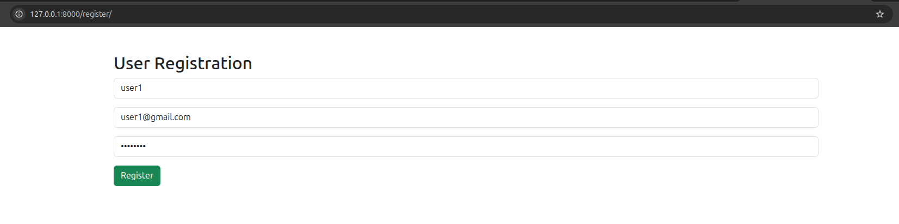
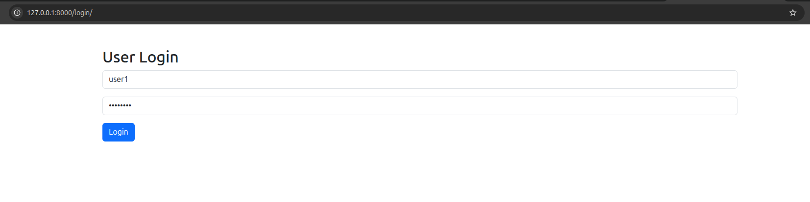

# CodeAlpha Simple E-Commerce Store

## Project Overview

This project was developed as part of the CodeAlpha Full Stack Development Internship.

The application is a Simple E-Commerce Store that allows users to browse products, view product details, register accounts, log in, add products to a shopping cart, and manage their shopping experience through a web interface.

## Features

* Product Listing Page
* Product Details Page
* User Registration
* User Login Authentication
* Shopping Cart Functionality
* Django Admin Panel
* SQLite Database Integration
* Responsive UI using Bootstrap

## Technology Stack

### Frontend

* HTML5
* CSS3
* Bootstrap 5
* JavaScript

### Backend

* Django (Python)

### Database

* SQLite3

## Project Structure

```text
CodeAlpha_EcommerceStore
│
├── ecommerce
├── store
├── templates
├── screenshots
├── manage.py
├── requirements.txt
└── README.md
```

## Installation

### Clone Repository

```bash
git clone https://github.com/vu241fa04e14-ctrl/CodeAlpha_SimpleE-commerceStore.git
```

### Create Virtual Environment

```bash
python -m venv venv
```

### Activate Virtual Environment

Linux:

```bash
source venv/bin/activate
```

Windows:

```bash
venv\Scripts\activate
```

### Install Dependencies

```bash
pip install -r requirements.txt
```

### Run Migrations

```bash
python manage.py makemigrations
python manage.py migrate
```

### Create Admin User

```bash
python manage.py createsuperuser
```

### Run Server

```bash
python manage.py runserver
```

Open:

```text
http://127.0.0.1:8000
```

## Screenshots

### Registration Page



### Login Page



### Product Details Page


### Admin Dashboard


### Admin Management


## Internship Task

CodeAlpha Full Stack Development Internship

Task 1: Simple E-Commerce Store

## Author

Kedhar T

B.Tech CSE

Vignan University
