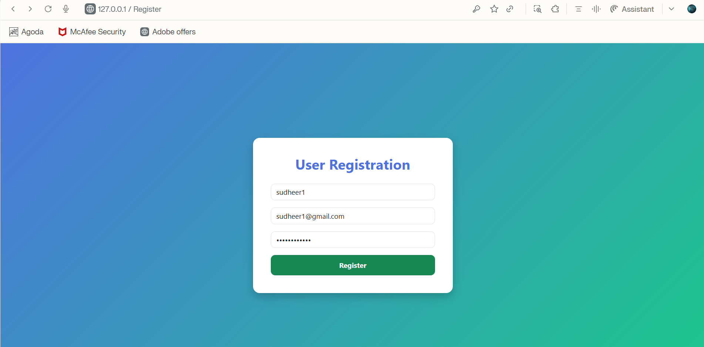
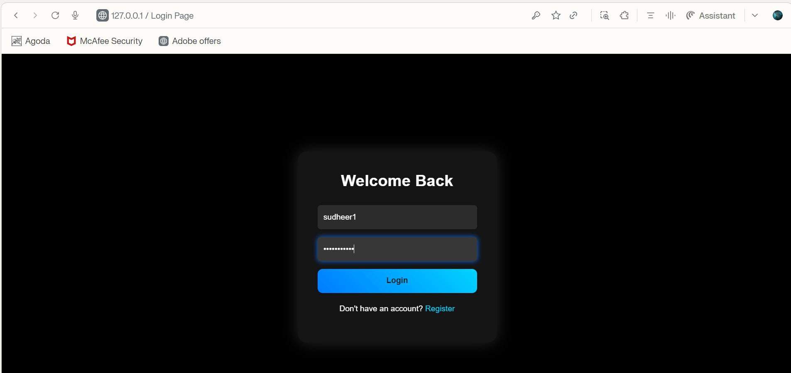
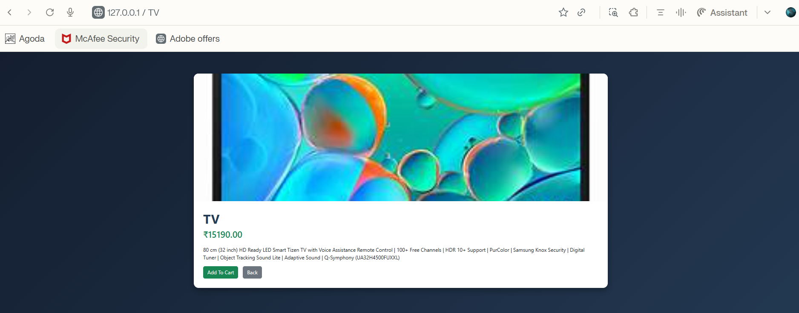
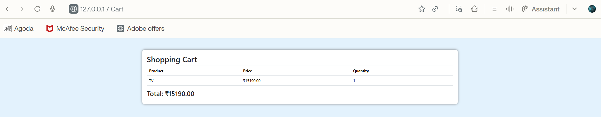
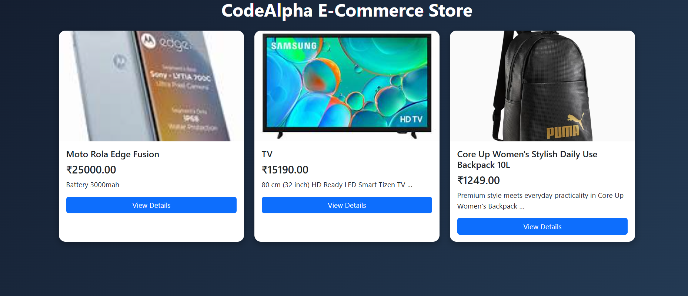
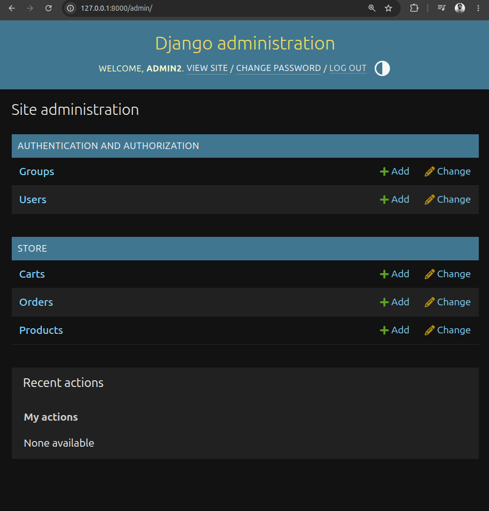
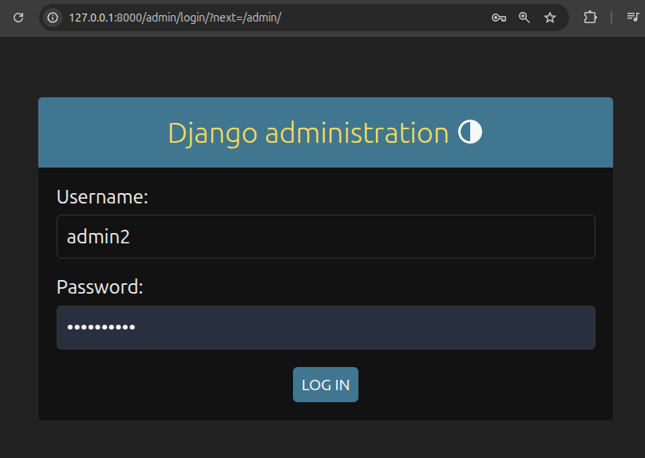

# 🛒 CodeAlpha Simple E-Commerce Store

## Full Stack Development Internship Project

### Internship Organization

CodeAlpha

### Internship Domain

Full Stack Development

### Task

Task 1 – Simple E-Commerce Store

---

# Project Description
The Simple E-Commerce Store is a full-stack web application developed using the Django framework. The system provides a complete online shopping experience where users can explore products, view detailed information, create accounts, log in securely, add products to a shopping cart, and manage their purchases efficiently.

This project demonstrates the practical implementation of web development concepts such as frontend design, backend processing, database management, user authentication, session handling, and dynamic content rendering. It was developed as part of the CodeAlpha Full Stack Development Internship to strengthen real-world software development skills and gain hands-on experience with modern web technologies.

---

# Objectives

* To design and develop a fully functional e-commerce web application.
* To understand and implement Django's Model-View-Template (MVT) architecture.
* To integrate a relational database for efficient data storage and retrieval.
* To implement secure user authentication and authorization mechanisms.
* To create a user-friendly shopping experience with interactive features.
* To perform CRUD (Create, Read, Update, Delete) operations using Django ORM.
* To gain practical experience in full-stack web development.
* To build a professional project suitable for portfolio presentation and internship evaluation.

---

# Features Implemented

## Product Management

The application allows users to browse available products through an organized product listing page.

Features include:

* Display of product images.
* Product names and pricing details.
* Product descriptions.
* Dedicated product detail pages.
* Dynamic product rendering from the database.* 

## User Authentication System

A secure authentication system has been implemented using Django's built-in authentication framework.

Features include:

* User Registration.
* Secure Login and Logout.
* Password Protection.
* Session Management.
* Restricted Access to User-Specific Features.
* Authentication-Based Navigation.

## Shopping Cart

The shopping cart module enables users to manage selected products before purchase.

Features include:

* Add products to cart.
* Remove products from cart.
* Update product quantities.
* View selected products.
* Automatic total price calculation.
* Session-based cart management.

## Database Integration

The application uses SQLite as its database management system for storing and managing application data.

Database entities include:

## Product Model

Stores:

* Product Name
* Product Description
* Product Price
* Product Image
## User Model

Stores:

* Username
* Email Address
* Password (Encrypted)
## Cart Model

Stores:

* User Information
* Product Information
* Quantity Details
## Order Model

Stores:

* Order Details
* Customer Information
* Purchase Records

## Administrative Features

The Django Admin Panel provides a powerful interface for managing application data.

Administrative capabilities include:

* Product Management.
* User Management.
* Order Monitoring.
* Database Maintenance.
* Product Addition and Modification.
* Record Deletion and Updates.

The admin dashboard enables efficient control of the entire system without requiring direct database access.

---

# Technology Stack

## Frontend Technologies

* HTML5
* CSS3
* Bootstrap 5
* JavaScript

## Backend Technologies

* Python
* Django Framework

## Database

* SQLite3

## Development Tools

* VS Code
* Git
* GitHub
* Ubuntu Linux

---

# Software Requirements

* Python 3.10+
* Django 5/6
* Git
* Web Browser
* VS Code

---

# Project Architecture

```text
CodeAlpha_EcommerceStore
│
├── ecommerce
│   ├── settings.py
│   ├── urls.py
│   ├── wsgi.py
│   ├── asgi.py
│   └── __init__.py
│
├── store
│   ├── admin.py
│   ├── apps.py
│   ├── models.py
│   ├── urls.py
│   ├── views.py
│   ├── migrations
│   └── tests.py
│
├── templates
│   ├── home.html
│   ├── login.html
│   ├── register.html
│   ├── product_detail.html
│   ├── cart.html
│   ├── orders.html
│   └── base.html
│
├── screenshots
│   ├── admin.png
│   ├── admin_administration.png
│   ├── login_page.png
│   ├── register_page.png
│   └── product_details.png
│
├── db.sqlite3
├── manage.py
├── requirements.txt
└── README.md
```


# Installation and Setup

## Clone Repository

```bash
git clone https://github.com/sudheerkalluri245-del/CodeAlpha_SImple-CommerceStore.git
```

## Navigate to Project

```bash
cd CodeAlpha_SImple-CommerceStore
```

## Create Virtual Environment

```bash
python -m venv venv
```

## Activate Virtual Environment

### Linux

```bash
source venv/bin/activate
```

### Windows

```bash
venv\Scripts\activate
```

## Install Dependencies

```bash
pip install -r requirements.txt
```

## Apply Migrations

```bash
python manage.py makemigrations
python manage.py migrate
```

## Create Admin User

```bash
python manage.py createsuperuser
```

## Run Application

```bash
python manage.py runserver
```

Open:

```text
http://127.0.0.1:8000
```

---

# Screenshots

## Registration Page



## Login Page



## Product Details Page



## Shopping Cart



## Home Page



## Admin Dashboard



## Admin Management



---

# Learning Outcomes

Through the development of this project, the following skills were acquired:

* Full-Stack Web Development.
* Django Framework Fundamentals.
* Database Design and Integration.
* User Authentication and Authorization.
* Session Management.
* CRUD Operations.
* MVC/MVT Architecture Understanding.
* GitHub Project Management.
* Deployment Preparation Techniques.

---

# System Workflow

* User visits the website.
* User browses available products.
* User registers or logs into an account.
* User views product details.
* User adds products to the shopping cart.
* Cart calculates total purchase amount.
* Order information is stored in the database.
* Administrator manages products and users through the admin panel.

---
## Conclusion

The Simple E-Commerce Store successfully demonstrates the development of a complete web-based shopping platform using Django. The project integrates frontend technologies, backend logic, database management, and user authentication into a single functional system. It serves as an excellent example of practical full-stack development and showcases the ability to build scalable web applications following industry-standard development practices.

---
# Author

Kalluri Siva Naga Sudheer

B.Tech – Computer Science and Engineering

Vignan's Foundation for Science, Technology and Research (Deemed to be University)

GitHub: https://github.com/sudheerkalluri245-del

---

# Internship Submission

CodeAlpha Full Stack Development Internship

Task 1: Simple E-Commerce Store
